# Physical-Examination-System
上海大学2022-2023年冬季学期数据库课程期末项目：基于vue、Django、mysql和tkinter的智慧体检系统。

## 初始化

将sql文件导入本地的数据库，更改`Django: Patient_back`和`Python: Docter`两个文件夹下的数据库设置

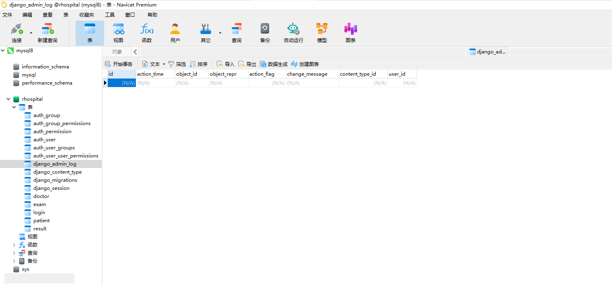

## 运行

从终端进入`test`文件夹启动vue前端界面

```shell
npm run serve
```

进入`Patient_back`文件夹启动Django后端

```shell
python manage.py runserver
```

进入`Docter`文件夹，直接运行`Run.py`文件启动医生前台及医生登录端

```shell
python test.py
```

## 用户端展示

### 登录界面

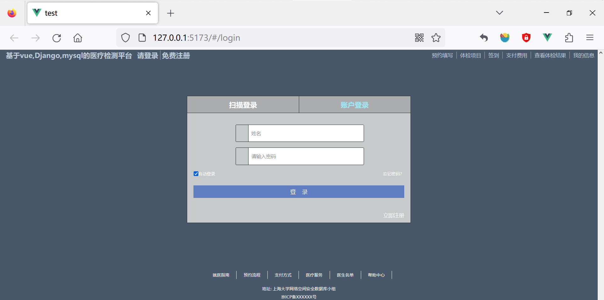

### 注册界面

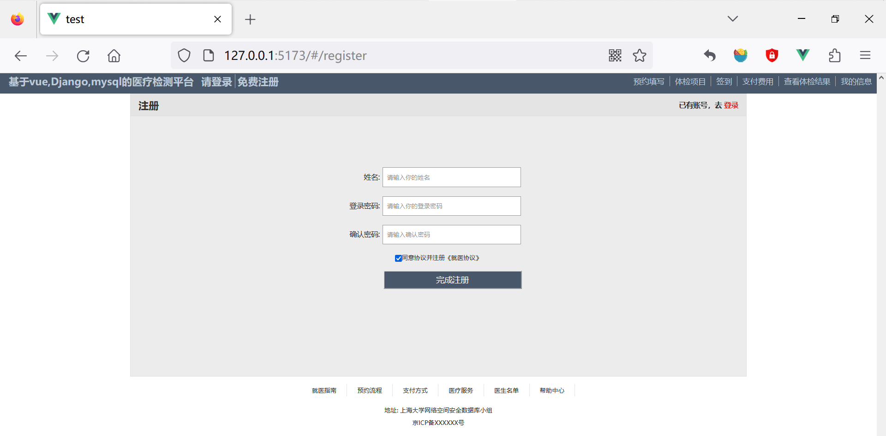

### 首页界面

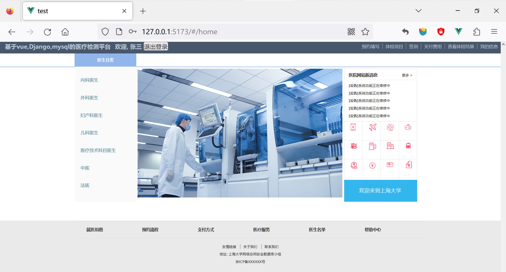

### 预约填写

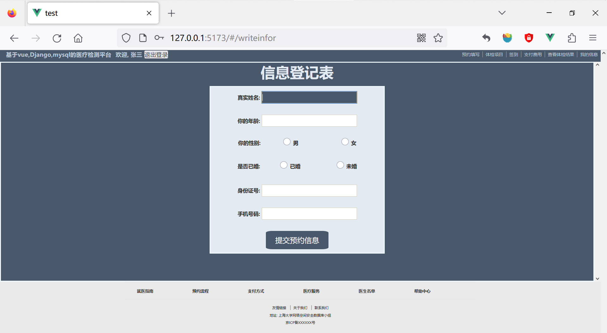

### 体检项目

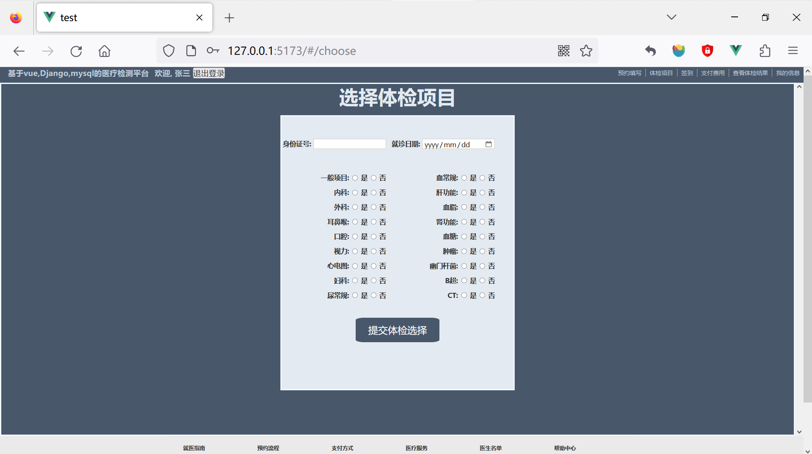

### 签到界面

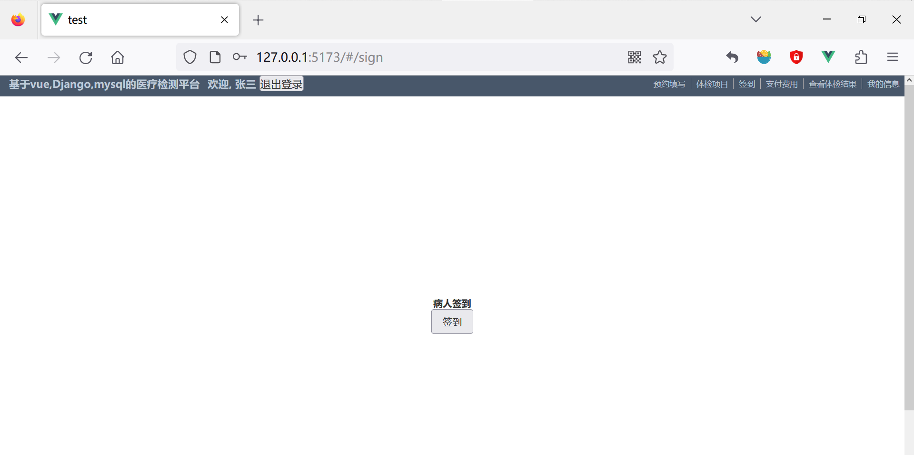

### 体检结果

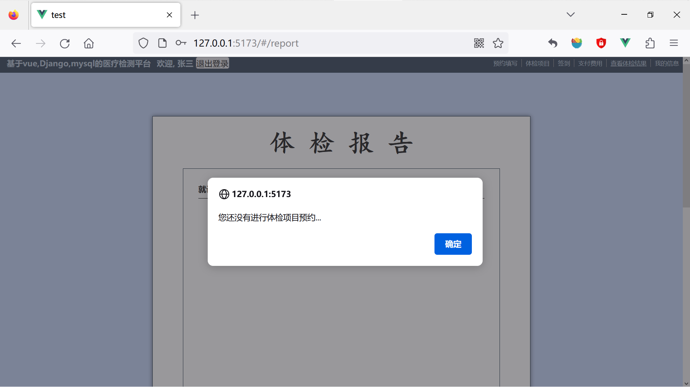

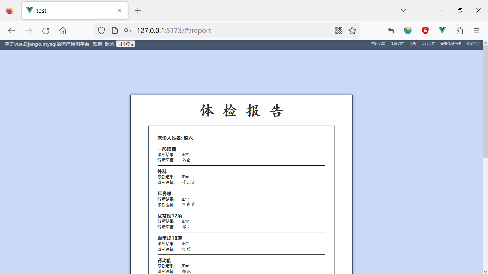

## 医生端

### 医生前台登录界面

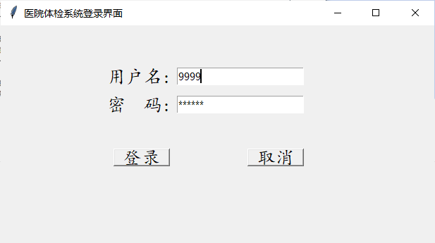

### 医生前台管理界面

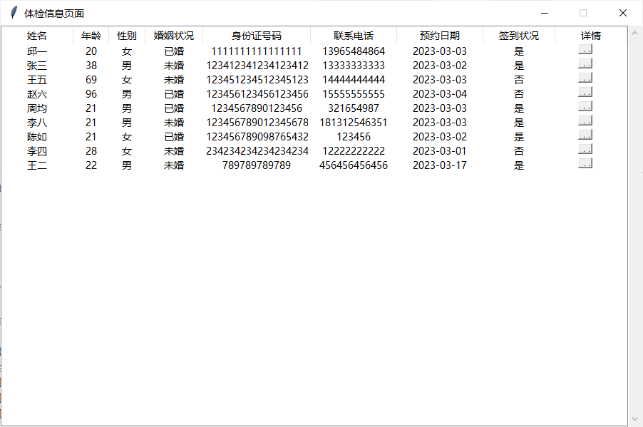

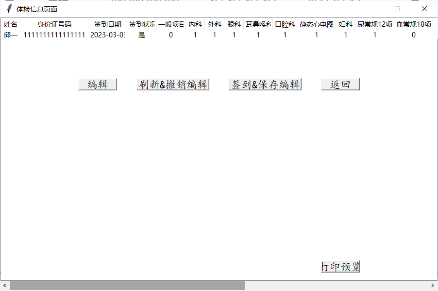

### 各科室医生界面

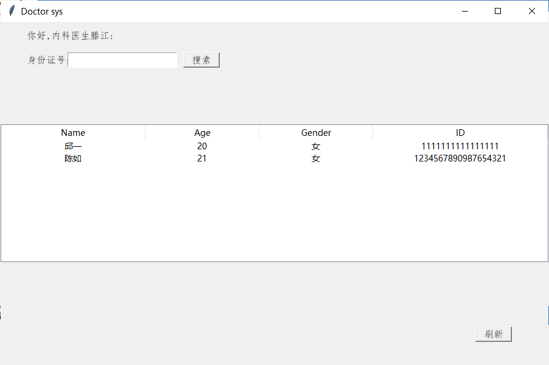

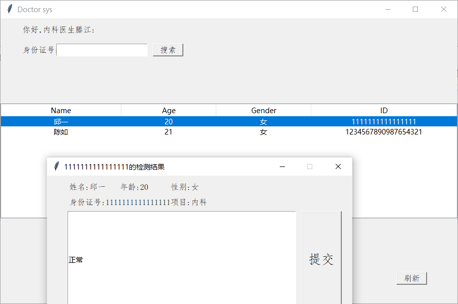

## 数据库展示

### docter

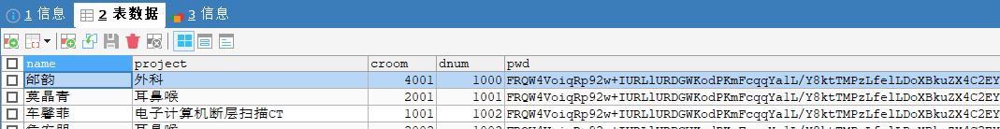

### exam

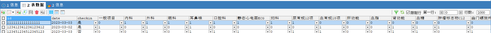

### login

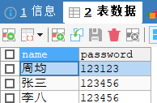

### patient

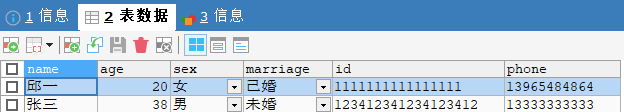

### result

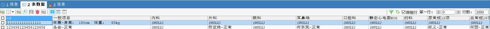
